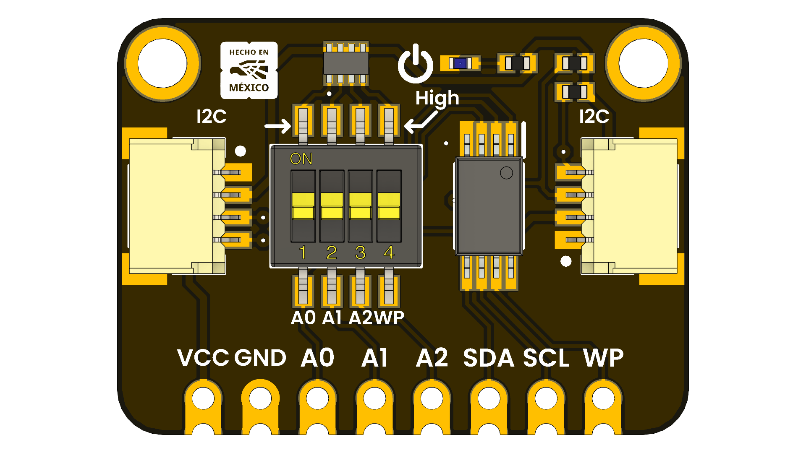

<!-- # ft24c32a_eeprom_module -->
# FT24C32A EEPROM Module

## Introduction

EEPROM module based on the FT24C32A chip, providing 32Kbits of non-volatile memory storage via I2C interface. Ideal for applications requiring reliable data retention and easy integration with microcontrollers.

    
    
    
    
     

  
  
<em>FT24C32A EEPROM Module</em>

### Quick Setup

## Overview

| Feature                      | Description                        |
|------------------------------|------------------------------------|
| **Memory Size**              | 32Kbits (4KB)                      |
| **Interface**                | I2C (Inter-Integrated Circuit)      |
| **Operating Voltage**        | 1.8V to 5.5V
| **Data Retention**           | 100 years                          |

## Applications
- Data logging
- Configuration storage
- IoT devices
- Embedded systems

## Resources
- [Product Wiki](#)
- [Datasheet](#)

## License

This product and its documentation are licensed under the MIT License.  
See [`LICENSE.md`](LICENSE.md) for details.

  Template by UNIT Electronics 

