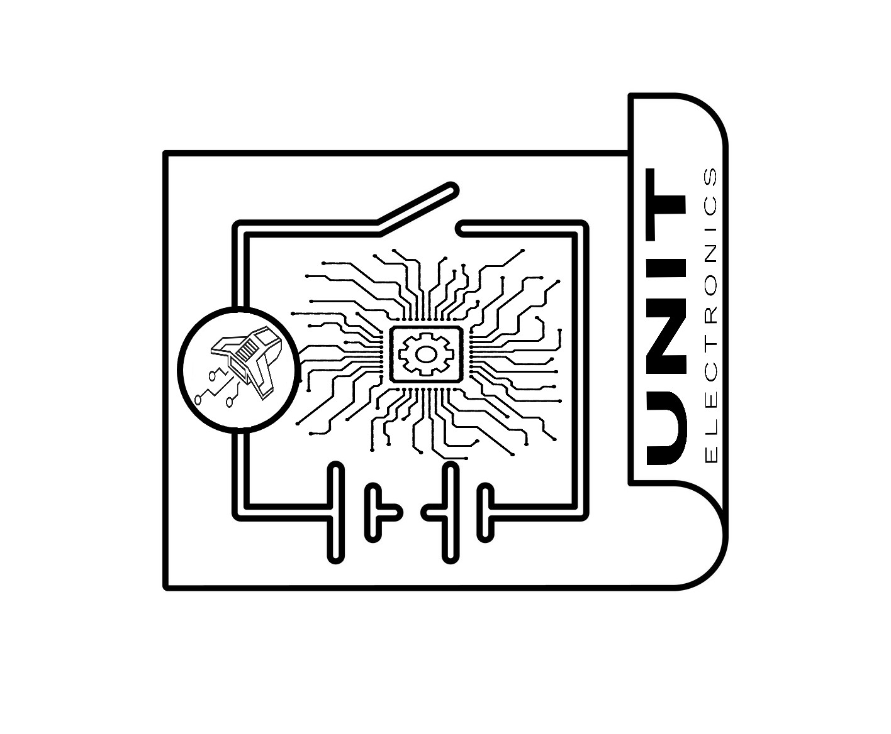
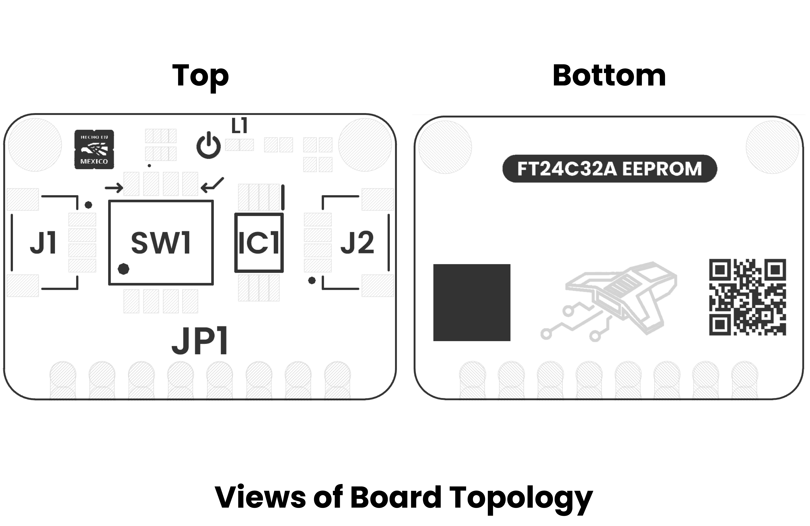

# Hardware

<a href="./unit_sch_v_1_0_0_ue0110_ft24c32a_eeprom_module.pdf"> Schematic</a>

## Technical Specifications

### Electrical Characteristics

| **Parameter** |           **Description**            | **Min** | **Typ** |  **Max**  |   **Unit**   |
|:-------------:|:------------------------------------:|:-------:|:-------:|:---------:|:------------:|
|      Vdd      | Input voltage to power on the module |   1.8   |    -    |    5.5    |      V       |
|      Icc      |         Supply read current          |    -    |   0.4   |    1.0    |      mA      |
|      Icc      |         Supply write current         |    -    |    2    |    3.0    |      mA      |
|     Isb1      |            Supply current            |  0.02   |    -    |     1     |      uA      |
|      Iil      |        Input Leakage Current         |    -    |    -    |    3.0    |      uA      |
|      Ilo      |        Output Leakage Current        |    -    |    -    |    3.0    |      uA      |
|      Vih      |          Input High voltage          | 0.7xVdd |    -    |  Vdd+0.5  |      V       |
|      Vil      |          Input Low voltage           |  -0.6   |    -    |  0.3xVdd  |      V       |
|      Vol      |   Output Low voltage for Vdd=3.0V    |    -    |    -    |   0.4V    |      V       |
|      NVc      |              Endurance               |    -    |    -    | 1,000,000 | Write Cycles |

## Pinout

    <a href="#"> Pinout</a>
     
     
     
    

## Pin & Connector Layout

| Pin   | Voltage Level | Function                                                  |
|-------|---------------|-----------------------------------------------------------|
| VCC   | 3.3 V – 5.5 V | Provides power to the on-board regulator and sensor core. |
| GND   | 0 V           | Common reference for power and signals.                   |
| SDA   | 1.8 V to VCC  | Serial data line for I²C communications.                  |
| SCL   | 1.8 V to VCC  | Serial clock line for I²C communications.                 |

> **Note:** The module also includes a Qwiic/STEMMA QT connector carrying the same four signals (VCC, GND, SDA, SCL) for effortless daisy-chaining.

## Topology

<a href="./resources/unit_topology_v_1_0_0_ue0110_ft24c32a_eeprom_module.png">  Topology</a>
 
 

| Ref. | Description                              |
|------|------------------------------------------|
| IC1  | FT24C32A EEPROM                          |
| L1   | Power On LED                             |
| SW1  | Dip Switch for Configuration             | 
| JP1  | 2.54 mm Castellated Holes                |
| J1   | QWIIC Connector (JST 1 mm pitch) for I2C |
| J2   | QWIIC Connector (JST 1 mm pitch) for I2C |

## Dimensions

<a href="./resources/unit_dimension_v_1_0_0_ue0110_ft24c32a_eeprom_module.png">  Dimensions</a>

# References

- <a href="./resources/unit_datasheet_v_1_0_0_ue0110_ft24c32a_eeprom.pdf">FT24C32A Datasheet</a>
